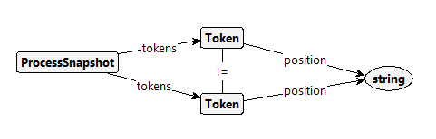
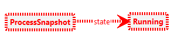

# BPMN specific properties

## Safeness

The atomic property **Unsafe** is implemented by the following graph condition in groove:

The property matches whenever two tokens of one process snapshot have the same position (but have different identities).

## Option to complete

The atomic property **AllTerminated** is implemented by the following graph condition in groove:

The property matches whenever there is no process snapshot in the state running. This all process snapshots are terminated, i.e., have no tokens.

# Implementation

## Tool
TODO: Link tool repo and tool website

## Test suite
| BPMN feature                                | Test class              | Test case                                                                                                    |
|---------------------------------------------|-------------------------|--------------------------------------------------------------------------------------------------------------|
| Exclusive event-based gateway instantiation | BPMNToGrooveGatewayTest | [Exclusive Event Based Gateway - Instantiate](https://cawemo.com/share/6db8059f-911b-4d2b-a8b3-83efb99ceed2) |
| Receive task instantiation                  | BPMNToGrooveTaskTest    | [Instantiate Receive Task](https://cawemo.com/share/e76c1763-4842-493c-bebb-cfa41e5abb09)                    |
| Activity                                    | BPMNToGrooveTaskTest    | [Sequential Tasks](https://cawemo.com/share/e9bca9c5-c750-487f-becf-737bbd6ea19b)                            |
|                                             |                         | [Implicit Parallel Gateway](https://cawemo.com/share/5e855137-d237-4bf7-bbf4-639c8e6093e0)                   |
|                                             |                         | [Implicit Exclusive Gateway](https://cawemo.com/share/9fdaa163-2b27-4787-99df-1ecf55971f14)                  |
|                                             |                         | [Send/Receive Message Tasks](https://cawemo.com/share/121dafdb-2ce5-4146-8f4e-315ab9bb0c38)                  |
| Gateway                                     | BPMNToGrooveGatewayTest | [Parallel Gateway](https://cawemo.com/share/7ac506cd-86f7-4c89-a946-1ab2b3707d92)                            |
|                                             |                         | [Parallel Gateway - Complex](https://cawemo.com/share/d0d0439d-31da-4b34-b508-aa75bc2551c8)                  |
|                                             |                         | [Exclusive Gateway](https://cawemo.com/share/9f739e59-c250-4f84-96cd-191914b07296)                           |
|                                             |                         | [Inclusive Gateway](https://cawemo.com/share/e5ab5920-be7c-435f-8d58-964760455caf)                           |
|                                             |                         | [Inclusive Gateway - Complex](https://cawemo.com/share/4edc1064-1a2f-46ba-b4bd-9bd3fceea7ae)                 |
|                                             |                         | [Exclusive Event Based Gateway](https://cawemo.com/share/c16c4923-dfa0-4a15-ade3-b47acb40ad66)               |
| ReceiveTask                                 |                         |                                                                                                              |
| ReceiveTask                                 |                         |                                                                                                              |
| ReceiveTask                                 |                         |                                                                                                              |
