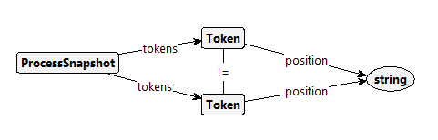
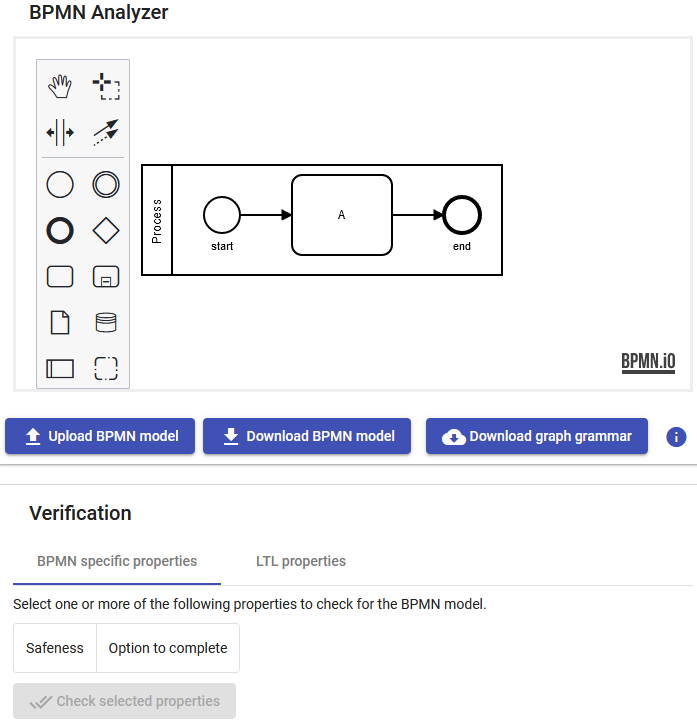

# Model Checking BPMN

## BPMN specific properties

### Safeness

The atomic property **Unsafe** is implemented by the following graph condition in Groove:

The property matches whenever two tokens of one process snapshot have the same position (but have different identities).

### Option to complete

The atomic property **AllTerminated** is implemented by the following graph condition in Groove:

The property matches whenever there is no process snapshot in the state running. All process snapshots are terminated, i.e., have no tokens.

## Custom properties
Defining atomic propositions directly in the tool by distributing tokens over the process model has not been implemented yet.
Thus, for the time being, custom properties have to be checked in Groove by defining atomic propositions there.

Adding this feature is planned for the full version of the paper due to the current time constraints.
# Implementation

## Tool
The tool is available online [here](https://bpmn-analyzer.herokuapp.com/).

The sourcecode of the tool is available [here](https://github.com/timKraeuter/Groove_Rule_Generation) and instructions how to run it locally on your machine can be found [here](https://github.com/timKraeuter/Groove_Rule_Generation/blob/master/server/README.md).

## Test suite
The test classes of the testsuite can be found in the subproject **generator** [here](https://github.com/timKraeuter/Groove_Rule_Generation).

| BPMN feature                                | Test class                      | Test case                                                                                                                |
|---------------------------------------------|---------------------------------|--------------------------------------------------------------------------------------------------------------------------|
| Exclusive event-based gateway instantiation | BPMNToGrooveGatewayTest         | [Exclusive Event Based Gateway - Instantiate](https://cawemo.com/share/6db8059f-911b-4d2b-a8b3-83efb99ceed2)             |
| Receive task instantiation                  | BPMNToGrooveTaskTest            | [Instantiate Receive Task](https://cawemo.com/share/e76c1763-4842-493c-bebb-cfa41e5abb09)                                |
| Activity                                    | BPMNToGrooveTaskTest            | [Sequential Tasks](https://cawemo.com/share/e9bca9c5-c750-487f-becf-737bbd6ea19b)                                        |
|                                             |                                 | [Implicit Parallel Gateway](https://cawemo.com/share/5e855137-d237-4bf7-bbf4-639c8e6093e0)                               |
|                                             |                                 | [Implicit Exclusive Gateway](https://cawemo.com/share/9fdaa163-2b27-4787-99df-1ecf55971f14)                              |
|                                             |                                 | [Send/Receive Message Tasks](https://cawemo.com/share/121dafdb-2ce5-4146-8f4e-315ab9bb0c38)                              |
| Subprocess                                  | BPMNToGrooveCallActivityTest    | [Call activity - Simple](https://cawemo.com/share/be4afe81-4adf-4b45-a933-5745316ee533)                                  |
|                                             |                                 | [Call activity - Implicit exclusive and parallel gateway](https://cawemo.com/share/321db543-e301-4bfd-ac04-e6618346433a) |
|                                             |                                 | [Call activity - Complex](https://cawemo.com/share/3b573dc4-3592-421d-9b13-dbb4e45ff410)                                 |
|                                             |                                 | [Call activity - No start event](https://cawemo.com/share/37764ed1-03e7-43c7-8218-34467a12d104)                          |
|                                             |                                 | [Call activity - Terminate end event](https://cawemo.com/share/63333b2a-8298-4e9c-8e1e-14453ed1f063)                     |
| Gateway                                     | BPMNToGrooveGatewayTest         | [Parallel Gateway](https://cawemo.com/share/7ac506cd-86f7-4c89-a946-1ab2b3707d92)                                        |
|                                             |                                 | [Parallel Gateway - Complex](https://cawemo.com/share/d0d0439d-31da-4b34-b508-aa75bc2551c8)                              |
|                                             |                                 | [Exclusive Gateway](https://cawemo.com/share/9f739e59-c250-4f84-96cd-191914b07296)                                       |
|                                             |                                 | [Inclusive Gateway](https://cawemo.com/share/e5ab5920-be7c-435f-8d58-964760455caf)                                       |
|                                             |                                 | [Inclusive Gateway - Complex](https://cawemo.com/share/4edc1064-1a2f-46ba-b4bd-9bd3fceea7ae)                             |
|                                             |                                 | [Exclusive Event Based Gateway](https://cawemo.com/share/c16c4923-dfa0-4a15-ade3-b47acb40ad66)                           |
| Events                                      | BPMNToGrooveEventsTest          | [Message events](https://cawemo.com/share/e6a2eb93-b0e7-4c09-baa0-93ff18084d0e)                                          |
|                                             |                                 | [Two Incoming Message Flows](https://cawemo.com/share/44d74e7b-f940-48cd-8ceb-d23976b4da2b)                              |_
|                                             |                                 | [Message Events without Message Flows](https://cawemo.com/share/b4b588fa-3f0f-4c30-95e9-b7f5dd40cd7a)                    |_
|                                             |                                 | [Two End Events](https://cawemo.com/share/e1777355-d0cc-45d0-8f01-87d08ba2b5ef)                                          |_
|                                             |                                 | [Terminate End Event](https://cawemo.com/share/e579995b-65f3-4146-a974-f136f5fd949b)                                     |_
|                                             |                                 | [Link Event](https://cawemo.com/share/519f49aa-e3ec-4d6d-8425-3933f93f974d)                                              |_
|                                             |                                 | [Signal Start Events](https://cawemo.com/share/b2db6ccf-1d3b-49c2-8739-0c53c069fd61)                                     |_
|                                             |                                 | [Signal events](https://cawemo.com/share/13dda53f-c28d-446f-9330-2cf73814c657)                                           |_
|                                             |                                 | [Signal events - Cross Process](https://cawemo.com/share/350bbe89-8c14-4ec2-a059-999a98ce92ea)                           |_
|                                             |                                 | [Intermediate Throw Event](https://cawemo.com/share/0b3cb831-a6b2-4e7c-b064-0c83e887bf47)                                |_
| Boundary Events                             | BPMNToGrooveBoundaryEventsTest  | [Subprocess - Interrupting Boundary Events](https://cawemo.com/share/3b55577a-e7ed-4729-a046-4d79fd11c941)               |
|                                             |                                 | [Subprocess - Non-Interrupting Boundary Events](https://cawemo.com/share/656b7c63-34e3-404f-9399-bbed9e22a8b7)           |
|                                             |                                 | [Task - Interrupting Boundary Events](https://cawemo.com/share/9acd9a23-65d7-46cd-bad5-b5b874333567)                     |
|                                             |                                 | [Task - Non-Interrupting Boundary Events](https://cawemo.com/share/8a322a8a-95ff-4773-aeb7-fba9635eefbb)                 |
| Event Sub Process                           | BPMNToGrooveEventSubProcessTest | [Event sub process - Interrupting](https://cawemo.com/share/ebb4b70a-f16a-4716-963e-2e6cda16550f)                        |
|                                             |                                 | [Event sub process - Non-interrupting](https://cawemo.com/share/fcd16a64-f192-49f6-ac34-e42af8d246f7)                    |
